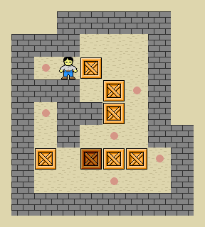

# Bomberman style game created in Java using Eclipse. Demonstrated the use of Object Oriented Design in Game Design through creating different classes for each game element. e.g. Boxes, Player, Bomb etc. 

So apparently this is called "Sokoban". <https://en.wikipedia.org/wiki/Sokoban> 

`public class Toaster2911 implements BoxThing`

*this gif moves too fast it's really annoying*
 

